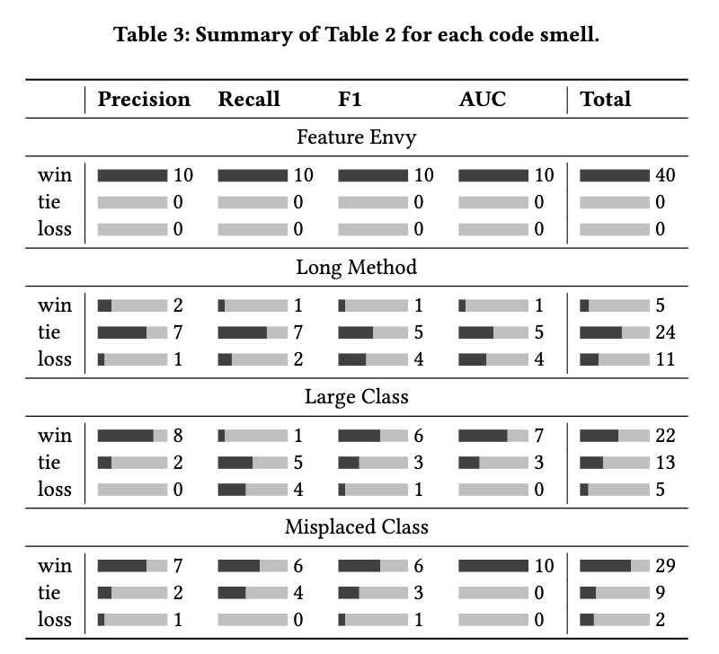
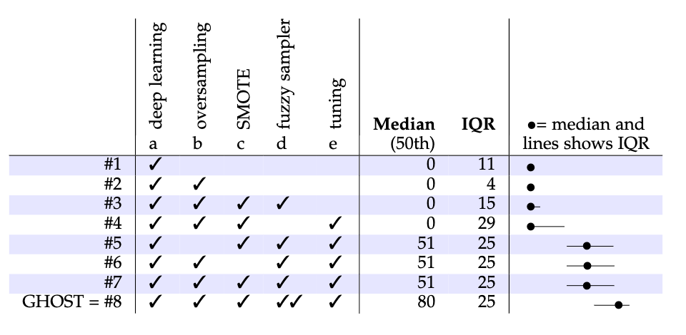

# RAISE Lab Onboarding

Welcome to the RAISE (Research on AI for SE) lab! This document is meant to help you pick stuff up quickly so you don't have to relearn stuff that the PhD students before you did. In general, you'll find a lot of the lab's collective wisdom over here.

## ARC

### Access

The CSC department has a high-performance computing cluster called ARC. See [the website](https://arcb.csc.ncsu.edu/~mueller/cluster/arc/) (under Obtaining an Account) for instructions on how to set up your account. You can generate the required RSA key using

```sh
ssh-keygen -t rsa -b 4096
```

If you're outside the NCSU network, you will not be able to ssh into the ARC cluster directly; you will need to use the Cisco VPN first. Alternatively, you could ssh into the NCSU EOS machines:

```sh
ssh remote.eos.ncsu.edu
```

And ssh into ARC from there. Note that in this case, you will need to generate your SSH keypair on the EOS machine, NOT your local machine.

### Usage

ARC uses the slurm manager to schedule jobs. There are a few commands you should know:

* `salloc` gives you an interactive shell. If you want to get a specific machine like `c30`, use `salloc -w c30`.
* `sinfo` gives you information about the nodes that are free, and what kind of system they are.
* `squeue` shows all the queued jobs. You want to use `squeue | grep <unity>` to check your jobs.
* `scancel` cancels a job that you started.

Do not run code on the login node! Either use `salloc` to get a node and run stuff there, or use `sbatch`, or one of the scripts below.

We have some [convenience scripts](https://github.com/yrahul3910/convenience-scripts) that you can use that wraps the above. To use these, first modify `run-template.sh` so that the last line reflects the actual command you want to run. Then, rename this file to `run.sh`. Once you're done, you can use `mk-jobs.sh` to create multiple copies of the same job to run multiple repeats of your experiments in parallel. Please be courteous and use your best judgement: if most of the compute nodes are used, don't take up all the remaining nodes. The usage is:

```sh
./mk-jobs.sh <repeats> ./run.sh
```

This will give you a list of the slurm job IDs that you started. Keep these in mind. Inevitably, you will sometimes realize your code has an error, or some other reason to stop all the jobs you just started. `rm-jobs` makes this easier for you, but note that it also deletes the log files:

```sh
./rm-jobs <first_job_id> <last_job_id>
```

Finally, the `status.sh` is a little script that helps you see the progress being made in each of your runs. You will need to modify this script so that the `grep` expression matches the format of the logs that your code actually prints out.

## The RAISE package

We have a package called `raise_utils` that provides wrappers around some common functionality. You can use `pip` or `poetry` to install it. The [repository](https://github.com/yrahul3910/raise) has some examples and docs that you can use to get started. Some of the features that are implemented are:

* Scott-Knott and Kruskal-Wallis tests
* Classification and distribution metrics
* Implementations of DODGE, GHOST, TPE, BOHB, and random HPO methods
* Convenience classes to load tabular datasets

## LaTeX Help

### Submitting to arXiv

Preprints are put up on arXiv before peer review. Although arXiv compiles LaTeX (and requires you to submit the LaTeX source), it has a few quirks. The main ones you will run into are:

* arXiv does not like directory structures. You'll have to flatten out your file structure before uploading.
* arXiv does not handle `.bib` files directly. You'll have to compile, and make sure you also add the `.bbl` file generated in your zip file. Overleaf has an option (under Submit), but it can be iffy. You might benefit from just having a local texlive installation and using it.

### Code in LaTeX

If you need to add code to your LaTeX, the `minted` package is your friend. However, arXiv historically does not like when you use minted. [This reply](https://github.com/gpoore/minted/issues/113#issuecomment-888045507) shows you how to get your code with `minted` up on arXiv:

1. Compile with `\usepackage[finalizecache,cachedir=.]{minted}`
2. Go to the output logs (in Overleaf, this is logs and output files -> other logs and files), and download everything with `pyg`.
3. Change `finalizecache` to `frozencache`, and upload all your files along with your `pyg` files.

### Bar and quartile charts

Occasionally, you will want to have a quartile chart or a bar showing a summary of your algorithm's wins/ties/losses against prior work. We have some commands that do this for you, depending on how you want to do things:

**Grayscale bars:**



```tex
% Preamble
\usepackage{xcolor}
\usepackage{calc}
\newcommand{\sbar}[1]{{\color{darkgray}\rule{\dimexpr 1cm * #1 / 100}{5pt}\color{lightgray}\rule{\dimexpr 1cm * (100 - #1) / 100}{5pt}}}

% Usage
\sbar{percentage}{value}
```

For example, if your method wins 7/10 times, you would use

```tex
\sbar{70}{7}
```

**Colored bars:**

 

```tex
\usepackage[table]{xcolor}

\xdefinecolor{g}{rgb}{0.063, 0.725, 0.506}
\xdefinecolor{y}{rgb}{0.98, 0.765, 0.114}
\xdefinecolor{r}{rgb}{0.937, 0.267, 0.267}
\newcommand{\sbar}[3]{{\color{g}\rule{\dimexpr 2cm * #1 / (#1 + #2 + #3)}{5pt}\color{y}\rule{\dimexpr 2cm * #2 / (#1 + #2 + #3)}{5pt}\color{r}\rule{\dimexpr 2cm * (#3) / (#1 + #2 + #3)}{5pt}}}
```

Usage:

```tex
\sbar{wins}{ties}{losses}
```

**Quartile plots:**

 

For quartile charts, here's the command to add in the preamble:

```tex
\newcommand{\quart}[3]{\begin{adjustbox}{max width=.2\linewidth}\begin{picture}(100,5)%1
    {\color{black}\put(#3,2){\circle*{7}}\put(#1,2){\line(1,0){#2}}}\end{picture}\end{adjustbox}}
```

You would use this as follows:

```tex
\quart{25%ile}{IQR}{median}
```

### Norms and absolute values

Writing out `\left\lvert` and `\right\rvert` each time is tedious. Use the commands below instead:

```tex
\usepackage{mathtools}

\DeclarePairedDelimiter\abs{\lvert}{\rvert}%
\DeclarePairedDelimiter\norm{\lVert}{\rVert}%
% Swap the definition of \abs* and \norm*, so that \abs
% and \norm resizes the size of the brackets, and the 
% starred version does not.
\makeatletter
\let\oldabs\abs
\def\abs{\@ifstar{\oldabs}{\oldabs*}}
%
\let\oldnorm\norm
\def\norm{\@ifstar{\oldnorm}{\oldnorm*}}
\makeatother
```

## Responding to Reviews

We have a standard way of replying to reviewers, which makes it easy for them to see where your changes are. In your LaTeX preamble, add the following:

```tex
\usepackage{framed}

\makeatletter
\renewenvironment{framed}{%
 \def\FrameCommand##1{\hskip\@totalleftmargin
 \fboxsep=\FrameSep\fbox{##1}
     \hskip-\linewidth \hskip-\@totalleftmargin \hskip\columnwidth}%
 \MakeFramed {\advance\hsize-\width
   \@totalleftmargin\z@ \linewidth\hsize
   \@setminipage}}%
 {\par\unskip\endMakeFramed}
\makeatother

% environment derived from framed.sty: see leftbar environment definition
\definecolor{formalshade}{rgb}{0.93,0.93,0.93}
\definecolor{darkblue}{rgb}{0.2, 0.2, 0.2}

\newenvironment{formal}{%
  \def\FrameCommand{%
    \hspace{1pt}%
    {\color{darkblue}\vrule width 2pt}%
    {\color{formalshade}\vrule width 4pt}%
    \colorbox{formalshade}%
  }%
  \MakeFramed{\advance\hsize-\width\FrameRestore}%
  \noindent\hspace{-1pt}% disable indenting first paragraph
  \begin{adjustwidth}{}{7pt}%
  \vspace{2pt}\vspace{2pt}%
}
{%
  \vspace{3pt}\end{adjustwidth}\endMakeFramed%
  }

%% Response text prefix
\newcommand{\respto}[1]{
\fcolorbox{black}{black!15}{%
\label{resp:#1}%
\bf\scriptsize R{#1}}}

%% Response text prefix
\newcommand{\bareresp}[1]{
\fcolorbox{black}{black!15}{%
\bf\scriptsize R{#1}}}
\newcommand{\BLUE}{\color{blue}}
\newcommand{\BLACK}{\color{black}}

%% Cite responses
\newcommand{\citeresp}[1]{%
{(see }\fcolorbox{black}{black!15}{%
\bf\scriptsize R{#1}}~{{on page \pageref{resp:#1})}}}%

\newenvironment{response}[2]{
    \par\noindent
    \BLUE 
    \respto{#1} {#2}%
}{
    \par\noindent
    \BLACK
}
\newcommand{\changed}[2]{\BLUE \respto{#1} {#2} \BLACK}
```

In your LaTeX, you'll probably change some text based on the reviewers' recommendations. For example:

```tex
The smoothness can be defined as \changed{1a1.1}{the supremum of the norm of the Hessian}.
```

This does a couple of things:
* It creates a label "R1a1.1", which means: "The first thing that we changed in response to Reviewer 1's first comment". In general, you the first argument will follow the structure: `<reviewer number>a<comment number>.<which point you are addressing>`. This way, if, for example, in response to Reviewer 2's second comment, you changed three things, and you want to add a reference to the third one, you'd use `\changed{2a2.3}{...}`.
* It changes the text color within the second argument to blue. If you have footnotes there, they will also change to blue.

Now, at the end of your file, you will add the responses. Start with this template:

```tex
\clearpage

\setcounter{page}{1}
\pagenumbering{roman}
\normalsize
\twocolumn
\newpage
\section*{Response to Reviewers}
\subsection*{Response to AE}

Some text here

\subsection{Response to Reviewer 1}

\begin{formal}  % This is an environment you defined above.
    Add their comment here
\end{formal}

\begin{response}{1a1}  % Change the numbering here: 1a1 means Reviewer 1, comment 1.
    Add your response here, and show where you have changed something, like this \citeresp{1a1.1}
\end{response}
```

The first set of commands is one-time, and sets up a new page for responses. The `formal` environment is a nice-looking box containing the text inside it. To each comment, you will add a corresponding `response` environment, passing in as the first argument, the reviewer number and the comment number (so `1a1` means Reviewer 1, comment 1). Having changed the text using the syntax above, you can now cite it using `\citeresp`, which will show the page number and the label where you made the changes.

### A more advanced version

Sometimes, you'll want to pass multiple references to `\citeresp`. Having multiple `\citeresp` is problematic because it produces multiple "(see ...)" texts. We can use LaTeX3's L3 programming layer to define a more advanced version of this command:

```tex
\usepackage{xparse}
\usepackage{expl3}

\ExplSyntaxOn

\NewDocumentCommand{\citeresp}{m}
{
  (see~
  \seq_set_split:Nnn \l_citeresp_items_seq {, } { #1 } % Split input into a sequence
  \seq_pop_right:NN \l_citeresp_items_seq \l_lastitem_tl % Pop the last item
  \seq_map_function:NN \l_citeresp_items_seq \__citeresp_format:n % Map each item
  \__citeresp_formatnocomma:n \l_lastitem_tl
  )
}

\cs_new_protected:Nn \__citeresp_format:n
{
  \fcolorbox{black}{black!15}{\bfseries\scriptsize R#1}~on~page~\pageref{resp:#1},~
}

\cs_new_protected:Nn \__citeresp_formatnocomma:n
{
  \fcolorbox{black}{black!15}{\bfseries\scriptsize R#1}~on~page~\pageref{resp:#1}
}

\seq_new:N \l_citeresp_items_seq % Define a unique sequence variable

\ExplSyntaxOff
```

This is not the most efficient code, but it works! You can now do something like `\citeresp{1a1.1, 1a1.2, 1a1.3}` and it will print "(see Ra1.1 on page 1, Ra1.2 on page 3, Ra1.3 on page 4)" (with the right page numbers.

For help on the L3 programming layer, see [this tutorial](https://www.alanshawn.com/latex3-tutorial/) and [the docs](https://ctan.math.washington.edu/tex-archive/macros/latex/required/l3kernel/interface3.pdf)
